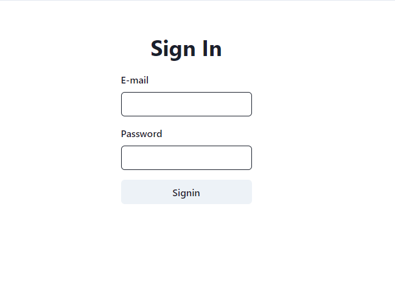
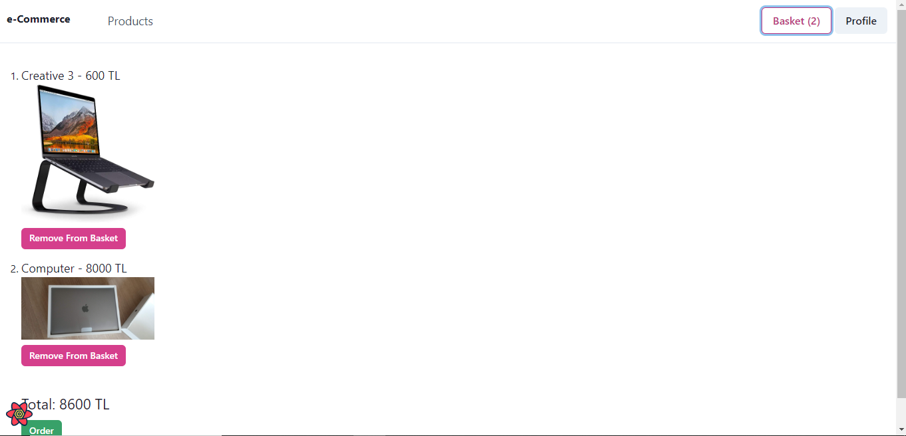

# E-Commerce React App
## Kullanılan Teknolojiler
* react-router-dom
* react-query
* react-context
* chakra-ui
* ant desing
 ## Backend Ayağa Kaldırma
 Mongodb ve Redis kurulumları yapıldıktan sonra 
 * ``` cd backend ``` komutu ile backend dizinine gidilir
 * Bu dizin altında .env dosyası oluşturularak gerekli bilgiler girilir (MONGO_URI kısmına bağlı olduğunuz locali girmelisiniz JWT_SECRET ve JWT_REFRESH_SECRET kısmı rastgele girilebilir. Örneğin:)
```
MONGO_URI=mongodb://localhost:27017
JWT_SECRET=sdgkMKEVlm3v23kl_n423vGG3b_TVnm234xnv23x
JWT_REFRESH_SECRET=rerv1jv15v1CVBnasd23jnv13123nvrqwr23
 ```
* ```npm run dev ``` komutu ile backend ayağa kaldırılır 


## Frontend Ayağa Kaldırma
* ``` cd client ``` komutu ile client dizinine gidilir ```npm start ``` komutu çalıştırılır.

## Uygulamadan Bazı Ekran Görüntüleri
* #### Sign Up Page

---
* #### Sign In

---
* #### Admin Page

---
* #### Order Page



